# 👩🏻‍💻 Maria Vitória Moraes

**`Analista de Dados & Processos | ADS (FATEC)`**

Sou estudante de Análise e Desenvolvimento de Sistemas na FATEC Sorocaba, focada em Automação de Dados, Business Intelligence e aplicação de Inteligência Artificial para otimização de processos. Atualmente, na Valid, aplico Python, SQL, Power Automate e Power BI para mapear fluxos operacionais, eliminar tarefas manuais e transformar dados em inteligência estratégica.

  
  
  

---

### 🤖 Habilidades & Tecnologias

  
  
  
  
  
  

- 🌐 **Desenvolvimento Web:** HTML5, CSS3, Git & GitHub
- 📊 **Análise & Visualização de Dados:** Power BI, Excel Avançado, Gestão de Dados
- ⚙️ **Automação & Processos:** Power Automate, Python, Engenharia de Prompts (IA)
- 🗄️ **Bancos de Dados:** SQL

---

### 📊 Estatísticas

  
  

## Como me encontrar?

